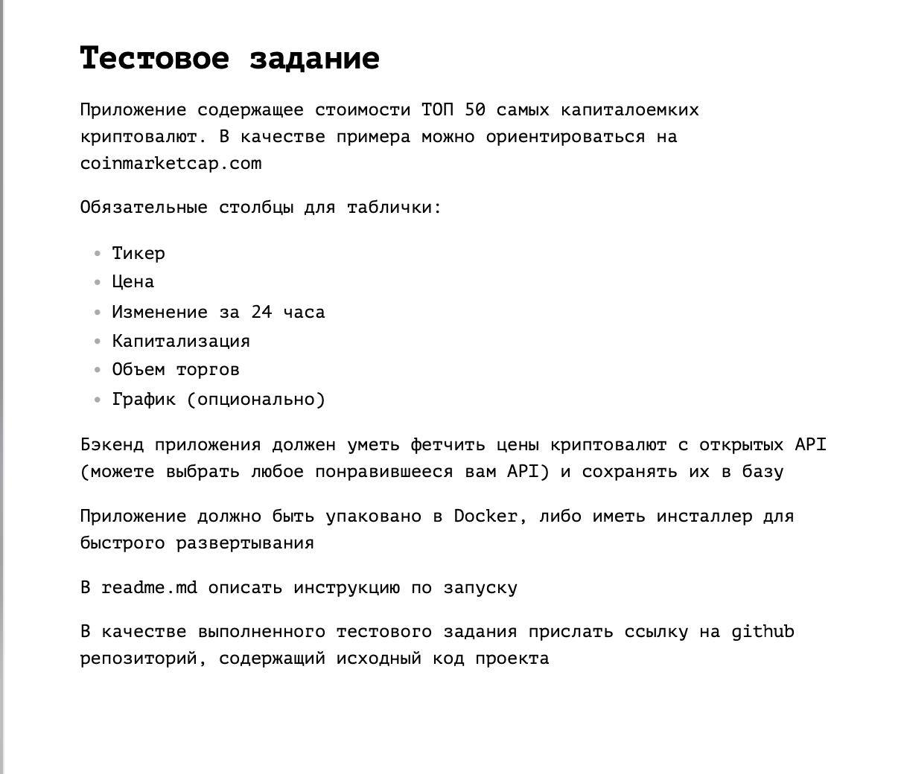

# Тестовое Задание - Top 50 Cryptocurrencies

Использовал CoinMarketCap API для получения данных по валютам Описание метода API: https://coinmarketcap.com/api/documentation/v1/?lid=ammybobljpiz#operation/getV1CryptocurrencyListingsLatest)

# Моменты

- Описание задачи очень поверхостно, в общих чертах реализовал, но для реальных задач нужно более детальное ТЗ
- Обнаружил что в API повторяется тикет: [symbol] => NEIRO и ещё несколько хоть он должен быть уникальным, как вариант можно использовать CoinMarketCap id валюты
- Про график вообще ничего не понятно

# Установка
- Импортировать таблицу в БД - topcoin_test_task.sql
- Залить файлы на хост
- Настроить данные подключение к БД в файле db.php
- Файл cron.php отвечает за получение данных с CoinMarketCap API и записи их в БД, по необходимости настроить cron добавить cron на нужный период

## Пример

Пример можно посмотреть здесь: https://fathom.unaux.com/topcoin/
